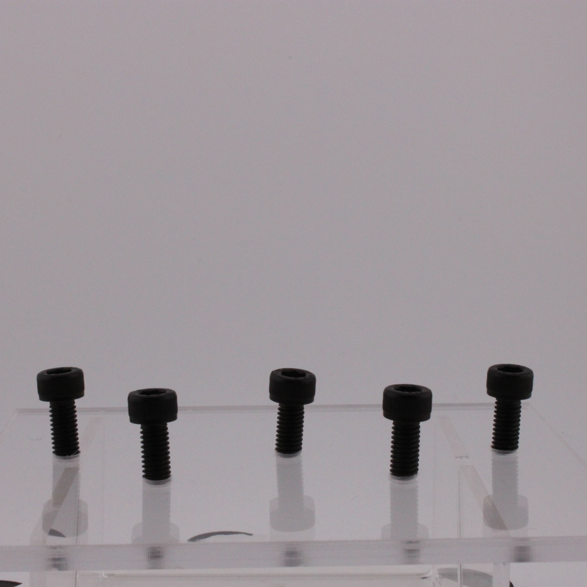

# Black Color Image Analysis
This purpose of this program is to analyze various images of fasteners such as bolts and nuts, and then provide a value that represents its color. The color black is the primary focus in this program, and it is meant to be normalized against a consistent background for relative analysis.

Future additions will include corrosion analysis through color analysis of red and white corrosion compared to the rest of the part.

## How it works currently
The program takes in a file path to an image you want to analyze. An example of a valid image can be seen below. It will then seperate out all the detected parts from the background by a grayscale threshold as well as edge recognition. 
Using the background as a normalization factor, the image is converted into the L* a* b* colorspace, and outputs blackness, color shift, glossiness, and median a* and b* values. 
For the best results, the same background should be white, and the same with all the images of parts you want to compare. Parts should not be white in color at best, and should not be similar to the background at minimum.

### Calculations used to determine color
* Blackness: The 10th percentile of the overall pixel L values on the part excluding specular highlights subtracted by the median L value of the background
* Color Shift: The euclidean mean of a* and b* values subtracted by the median a and b values of the background
* Glossiness: The fraction of the part that is highlights over the fraction of the part that is shadows determined by the 95th percentile of the L value. Combined with the mean value of the highlights to get a gloss score that encapsulates both intensity and gloss fraction.
* Median a*: Median value of a* across all pixels on the part
* Median b*: Median value of b* across all pixels on the part

## Requirements
This program utilizes python and the following packages
* numpy
* matplotlib
* pandas
* scikit-image
* streamlit

## What images work with it
This program works with JPG, JPEG, and PNG files.
For the best comparison of blackness, parts that are taken in the same conditions (light box, lighting, and camera settings) should be used as a difference in any of these factors will impact the normalization of the image, thus artifically changing the color provided. The lightbox should be the same throughout as the program assumes the background should be the same for every photo and uses it as a baseline to color correct each image.

Photos should be shot in Manual mode, specifically manual exposure settings and white balancing, as modern cameras will adjust the colors individually behind the scenes in a non-linear way to make them more accurate to the eye that is difficult to fix without more information.

## Running program in command line
Make sure you have python installed on your device, and you have all the required packages.
You can view the required packages in the `requirements.txt` file, and you can install them through a bash script by running `bash install.sh`

### Entirely in command line
In order to run image analysis on a certain image, you will want to navigate to the ColorAnalysis directory, and then run `python app.py`

This will then lead you to input the file path of the image you want to analyze. The base folder that it is in currently is the ColorAnalysis directory.

Next it will tell you to input the directory path of where you want all images and csv files of the image analysis to be stored.

What this will output is a table of the Blackness, Color Shift, Glossiness, median a* and b* values, and plots representing the masking and regions for the parts. You can end the program by closing out of the plots.

### Using a user interface
To run all this through Stremlit UI, run `streamlit run streamlit_app.py`
This will open a web-app that you can access through the link provided in the terminal. When you analyze an image using this method, it does not save automatically, but has options to download files as needed.

## Running program online
This repo is hosten on the Streamlit Community Cloud for access at
https://coloranalysis-vs8xiz2jstv7uv2ckx2ygt.streamlit.app/
